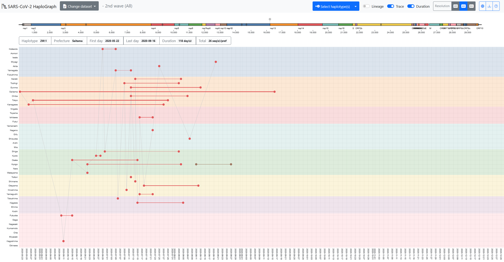

# SARS-CoV-2 HaploGraph

## Introduction

SARS-CoV-2 HaploGraph visualizes the emergence timing and geographical transmission of the SARS-CoV-2 haplotypes from the 2nd to 5th epidemic waves in Japan using genome data obtained from GISAID as of June 4, 2022. For each epidemic wave, one ancestral haplotype was determined, and evolutionary dynamics of SARS-CoV-2 haplotypes were shown for each prefecture in Japan by tracking nucleotide substitutions, insertions, and deletions.

## Data used

GISAID EpiCoV data downloaded as of June 4, 2022 was used. Japan-related SARS-CoV-2 genomes were extracted based on the annotation in the metadata files. The GISAID IDs used in SARS-CoV-2 HaploGraph was summarized in [doi.org/10.55876/gis8.221004wz](http://doi.org/10.55876/gis8.221004wz).

The start and end dates of each epidemic wave followed  [the records of the Ministry of Health, Labour and Welfare (MHLW) of Japan](https://www.mhlw.go.jp/content/10900000/000931584.pdf).

* 2nd: 2020-06-14 to 2020-10-09
* 3rd: 2020-10-10 to 2021-02-28
* 4th: 2021-03-01 to 2021-06-20
* 5th: 2021-06-21 to 2021-12-16

The statistical data compiled for each haplotype is in the TSV (Tab Separated Values) file in covid19/docs/data/. Each column indicates the following information.

* Column 1: haplotype (see help for naming details)
* Column 2: first, the first date of the sampling of the haplotype
* Column 3: last, the last date of the sampling of the haplotype
* Column 4: duration, difference between first and last sampled date
* Column 5: total, total number of genomes in a given haplotype
* Column 6: prefecture, Prefecture for the information

## Haplotype

We obtained the variations for each SARS-CoV-2 genome stored in GISAID by aligning the genome sequences to the reference genome Wuhan-Hu-1 (RefSeq ID: [NC_045512](https://www.ncbi.nlm.nih.gov/nuccore/NC_045512.2)) using [MAFFT](https://mafft.cbrc.jp/alignment/software/) version 7.490 with default options (Katoh et al., 2019). Based on the pairwise alignment, mutations on different nucleotide sites were identified as substitution, insertion, or deletion. We then obtained the haplotype of each genome sequence by classifying the single nucleotide variants (SNVs) contained in the genome. Note that continuous indels are treated as one SNV in this study because they could be caused by a single mutation.

For each SARS-CoV-2 epidemic wave in Japan, the reference haplotype was determined as the sequence with an early sampling date with the minimum number of SNVs. The ID for each haplotype was assigned as follows. First, the reference haplotype was named "1" and if there were more than one reference haplotype in a lineage, we increased the number (i.e., 2, 3, …). Then, when a haplotype acquires one SNV, a number is added and connected to the first number with a dot (i.e., "."). For example, "1._N_" (where _N_ is any number) indicates the acquisition of one specific mutation from haplotype 1. Backward mutations when an SNV reverts back to the Wuhan-Hu-1 wild type genome state were also counted. In such cases, the haplotype was started by a lowercase "d" before the backward mutation. For example, a mutation "dG26849T" indicates the haplotype contains a backward mutation "G" at position 26849 (i.e., the genotype is the same as that of Wuhan-Hu-1) although the reference haplotype of the lineage has the mutation "T" at the same position. In cases where there were multiple candidates for an immediate ancestor of a haplotype, we selected the oldest haplotype (the one sampled on the earliest date) and the other haplotype(s) are concatenated with a pipe (i.e., "\|"). If an immediate descendant with a single mutational difference was not found, a two-step forward descendant was searched. When it was found, an "x" was used to indicate the unknown intermediate state. For example, "1.2.x.1" is a haplotype with two SNVs from haplotype 1.2. If both of two intermediate states were not found, the haplotype would start with a letter in alphabetical order according to the number of SNVs compared to the reference haplotype of the lineage. For example, a haplotype "c.1" has three SNVs compared to the reference haplotype and its ancestors are not traceable within 1 or 2 SNVs till the reference haplotype.

## Usage

In the SARS-CoV-2 HaploGraph webpage, from the "Change dataset" on the top menu bar, the dataset for an epidemic wave can be selected. Two datasets are available for each wave: "All" and "50%". Note that "All" is only available for the [GitHub version](https://ktym.github.io/covid19/). "All" contains all haplotypes, and "50%" includes all haplotypes up to the smallest frequency haplotype whose sum exceeds 50% when all frequencies are ordered from highest to lowest. Then, the "Select haplotype(s)", one or more haplotype(s) can be selected. 

The X-axis or Y-axis indicates the sampling date or prefecture. In each prefecture (47 prefectures in total), the dots indicate the earliest or the latest sampled dates, and they are connected with a line the thickness of which is correlated with the number of entries sampled in that prefecture. A schematic representation of the SARS-CoV-2 genome is shown in a colored bar. 

On the genome bar, the gray diamonds indicate the genomic locations of the mutations contained in the reference haplotype of the selected wave. The grey pins above the genome bar indicate the schematic genomic location of the mutation(s) contained in the selected haplotype(s): "1.1" shown in the grey dots and line in this figure indicates SNVs compared to the reference haplotype of each epidemic wave. 

The 6 boxes under the genome bar describe: 1) "Haplotype", the wave and haplotype name; 2) "Prefecture", the prefecture where the haplotype was sampled; 3) "First day", the earliest date, and 4) "Last day", the latest date of the entries sampled in the prefecture; 5) "Duration", the time span by day(s); and 6) "Total", the total number entries of the haplotypes sampled in the prefecture. 

These particulars change when a different prefecture within its "Duration" period is touched by the cursor. When the "Trace" option is on, the earliest entries of different prefectures would be connected by line in time order. However, it doesn't mean that those earliest entries were related during the spread of the haplotype. When the "Lineage" option is on, the entries of ancestral haplotypes of the selected haplotype would appear and be connected with dashed lines. In this figure, the earliest or latest entry of the haplotype "1" is surrounded by a square or a circle of the same color as the haplotype. Note that this is not by the function of the viewer. The colors for displaying the selected haplotypes are adopted randomly by the viewer.

## Limitation and notes

1) Not all genomes of the SARS-CoV-2 that spread in Japan were sampled, sequenced, and stored in GISAID

The sampling of SARS-CoV-2 genomes could also be biased depending on the area and dates. Therefore, when and where a variant was detected for the first time is not necessarily the location and date of the first emergence of the variant. On the other hand, the number of COVID-19 patients and the number of sequenced SARS-CoV-2 genomes were well correlated for the periods of the 1st to the 5th waves in Japan (Pearson’s correlation coefficient, r = 0.962, P-value < 0.001). This observation suggests that haplotypes visualized by SARS-CoV-2 HaploGraph could roughly represent the transmission of SARS-CoV-2 in Japan, although more than 90% of SARS-CoV-2 genomes sampled from COVID-19 patients were not sequenced. 

2) The GISAID database restricts users from providing detailed information on nucleotide substitutions which are derived from the database

According to the GISAID term of use, the data stored in the GISAID should not be displayed or accessed through a separate portal or a network of institutions (https://www.gisaid.org/registration/terms-of-use/; Arita 2021). This policy makes it difficult to provide details on the mutations of the SARS-CoV-2 variants on the SARS-CoV-2 HaploGraph browser.

3) Quality of genomes could differ depending on the sequencing laboratories

For the viewer, we used the "complete genomes" - genomes without any undetermined and mixed nucleotides - for the identification of all variants in each genome. Nonetheless, the sequencing quality of Japan on SARS-CoV-2 genomes is considerably high compared to that of the overseas. For instance, the proportion of the sequences that contain 0 or 10 undefined nucleotides reached 89.4% or 91.1% in the entries sequenced in Japan, while it was 36.0% or 48.0% in the entries sequenced in other countries. This was one important factor that made this study possible with reliable results. 

4) Recombination of variants were not considered. 

Some variants may emerge though recombination events. It is difficult to distinguish whether mutation(s) emerged by recombination or parallel evolution when the number of mutations is limited. Indeed, many recombination events are reported for the SARS-CoV-2 genomes, particularly for the Omicron variants ([Ou et al., 2022](https://doi.org/10.1038/s41392-022-00992-2)). Since various nucleotide substitutions accumulated in the genomes of Omicron variants, recombination of Omicron variants could be easily detected. Before the Omicron strain arose, one of the few examples of recombinant strains reported was the XC variant, a recombination of the Delta and Alpha mutants detected in Japan ([Sekizuka et al., 2022](https://doi.org/10.7883/yoken.JJID.2021.844)). The lack of consideration of recombination is one of the limitations of this study.

## Reference

Please see the following paper for the details of this website:

(Preprint) 
So Nakagawa, Toshiaki Katayama, Lihua Jin, Jiaqi Wu, Kirill Kryukov, Rise Oyachi, Junko S Takeuchi, Takatomo Fujisawa, Satomi Asano, Momoka Komatsu, Jun-ichi Onami, Takashi Abe, Masanori Arita.
SARS-CoV-2 HaploGraph: visualization of SARS-CoV-2 haplotypes spread in Japan. Jxiv. 2023 DOI: [10.51094/jxiv.338](https://doi.org/10.51094/jxiv.338)

## Acknowledgement

We gratefully acknowledge all data contributors: scientists and medical staff, their originating laboratories responsible for obtaining the specimens, and their submitting laboratories for generating the genetic sequence and metadata and sharing via the GISAID Initiative: [10.55876/gis8.221004wz](http://doi.org/10.55876/gis8.221004wz)

This work was supported by the JST CREST JPMJCR20H6 and JPMJCR20H1, by AMED JP20he0622043 and JP20fk0108536, and by ROIS (Research Organization of Information and Systems).
