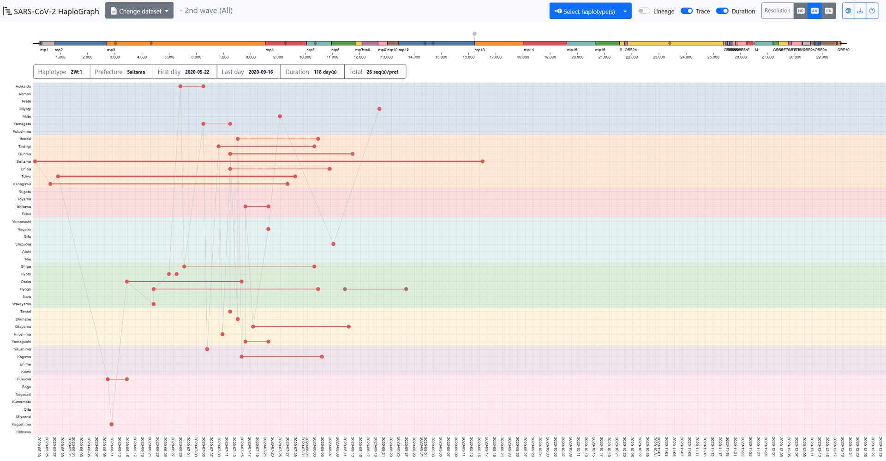

## はじめに

SARS-CoV-2 HaploGraphは、2022年6月4日時点でGISAIDから取得した新型コロナウイルスのゲノムや関連データを用いて、日本における第2〜第5流行波のSARS-CoV-2ハプロタイプの都道府県ごとの出現・消失時期および伝播状況を可視化したものである。各流行波について、1つの祖先ハプロタイプを決定し、塩基置換、挿入、欠失を追跡することにより、日本国内における新型コロナウイルスの流行動態を示した。

## データセット

2022年6月4日時点の[GISAID EpiCoVデータ](https://gisaid.org)を使用した。GISAIDのメタデータファイルのアノテーションに基づいて日本国内で流行したウイルスを検出した。SARS-CoV-2 HaploGraphで使用したGISAID IDは[doi.org/10.55876/gis8.221004wz](https://doi.org/10.55876/gis8.221004wz)にまとめた。

各流行波の開始日、終了日は[厚生労働省の資料](https://www.mhlw.go.jp/content/10900000/000931584.pdf)に従った。

* 2nd: 2020-06-14 to 2020-10-09
* 3rd: 2020-10-10 to 2021-02-28
* 4th: 2021-03-01 to 2021-06-20
* 5th: 2021-06-21 to 2021-12-16

各ハプロタイプに関して集計した統計データはcovid19/docs/data/の中のTSVファイルにある。各列に関して下の情報をまとめてある。

* 1列目 haplotype:（命名の詳細はhelpを参照）
* 2列目 first: 初めてサンプリングされた日
* 3列目 last: 最後にサンプリングされた日
* 4列目 duration: 最初と最後のサンプリングされた日の差
* 5列目 total: サンプリングされた総数
* 6列目 prefecture: サンプリングされた都道府県

## ハプロタイプ

GISAIDに保存されている各SARS-CoV-2ゲノムについて、[MAFFT](https://mafft.cbrc.jp/alignment/software/)を用いて標準ゲノムWuhan-Hu-1 (RefSeq ID: [NC_045512](https://www.ncbi.nlm.nih.gov/nuccore/NC_045512.2)) に対してペアワイズアライメントした。ペアワイズアライメントに基づき、塩基置換、挿入、または欠失について同定した。以下の方法に基づき、ゲノムに含まれる一塩基変異（SNV）をもとにハプロタイプの関係を推定した。なお、連続した挿入・欠失は、1つの変異によって引き起こされる可能性があるため、本研究では1つのSNVとして扱った。

* 日本でのSARS-CoV-2の流行波ごとに、SNVの数が標準ゲノム（Wuhan-Hu-1）と比較して最小となり、かつサンプリング日の早い配列を祖先型のハプロタイプとして、。各ハプロタイプのIDは以下のように決定した。祖先ハプロタイプに「1」という名前をつけ、ある系統に複数の祖先ハプロタイプがある場合は、その番号を増やした（すなわち、2、3、・・・）。
* あるハプロタイプが1つのSNVを獲得すると、番号を追加し、最初の番号とドット（"."）でつなげた。例えば、"1._N_"（_N_は任意の数）は、ハプロタイプ1から特定の変異を1つ獲得したハプロタイプであることを示す。
* 標準ゲノムに戻る変異をもつ場合もカウントした。この場合、ハプロタイプは後方変異の前に小文字の"d"を付けて開始した。例えば、「dG26849T」という変異は、その系統の祖先ハプロタイプは同じ位置に変異「T」を持つが、Wuhan-Hu-1と同じ「G」をもつハプロタイプであることを示す。
* あるハプロタイプの祖先ハプロタイプの候補が複数ある場合は、最も古いハプロタイプ（最も古い日付でサンプリングされたもの）を選択し、他のハプロタイプ（複数）はパイプ（"\|"）で連結して示した。
* 1つの変異の違いを持つ直系の子孫が見つからなかった場合、2段階前の子孫を検索した。見つかった場合は、未知の中間状態を示すために"x"を使用した。例えば、"1.2.x.1"はハプロタイプ1.2から2つのSNVを持つハプロタイプである。
  * 2つの中間状態の両方が見つからなかった場合、ハプロタイプは、その系統の参照ハプロタイプと比較してSNVの数に応じたアルファベット順の文字で始まることになる。例えば、ハプロタイプ"c.1"は、参照ハプロタイプと比較して3つのSNVを有し、その祖先は参照ハプロタイプから1または2つのSNVで追跡することが不可能であった場合である。

## 使い方

SARS-CoV-2 HaploGraphの、上部メニューバーの"Change dataset"から、各流行波のデータセットを選択できる。各流行波で2つのデータセット、"All"と"50%"が選択できる（"All"は[GitHub版](https://ktym.github.io/covid19/)のみ）。"All"にはすべてのハプロタイプが含まれ、"50%"には、すべての頻度を高いものから低いものに並べたときに、合計が50%を超える最小の頻度のハプロタイプまでのすべてのハプロタイプが含まれる。次に、"Select haplotype(s)"で、1つ以上のハプロタイプを選択することができる。

X軸に新型コロナウイルスのサンプリング日、Y軸に都道府県が示されている。各都道府県（47都道府県）において、ドットは最も古いサンプリング日または最も新しいサンプリング日を示し、その都道府県でサンプリングされたエントリーの数に相関する太さの線で結ばれている。

上部にはSARS-CoV-2ゲノムの模式図をカラーバーで示している。ゲノムバー上の灰色の菱形は、選択された波の参照ハプロタイプに含まれる変異のゲノム上の位置を示している。ゲノムバーの上のグレーのピンは、選択されたハプロタイプに含まれる変異の座位を示している。

ゲノムバーの下にある6つのボックスは以下項目に該当する。

* Haplotype: 流行波とハプロタイプ名
* Prefecture: ハプロタイプがサンプリングされた都道府県
* First day: その都道府県でサンプリングされたハプロタイプの最初の日付
* Last day: その都道府県でサンプリングされたハプロタイプの最後の日付
* Duration: その都道府県でサンプリングされたハプロタイプの期間
* Total: その都道府県でサンプリングされたハプロタイプの合計数

上記の項目は、カーソル（矢印）で選択したハプロタイプに合わせて変化する。"Trace"のオプションをオンにすると、異なる都道府県の最も古いエントリーが、時間順に線で結ばれる。ただし、この点線は新型コロナウイルスの直接の伝播を結びつけるものではありません。"Lineage"のオプションをオンにすると、選択したハプロタイプの祖先となるハプロタイプのエントリーが表示される。選択されたハプロタイプを表示するための色は、ビューアによってランダムに採用される。

## 利用上の注意点

1) 日本で感染が広がったすべての新型コロナウイルスのゲノムがサンプリング・配列決定されて、GISAIDに登録されたわけではない。そして、新型コロナウイルスのゲノムのサンプリングは、地域や日時によって偏りがある可能性もある。したがって、ある変異ウイルスがいつどこで初めて検出されたという情報は、必ずしもその地域で変異ウイルスが誕生したとは限らない。一方、COVID-19患者数とSARS-CoV-2ゲノム解読数は、日本における第1波から第5波の期間において、強い相関があった（ピアソンの相関係数、r = 0.962、P値 < 0.001、詳細は論文を参照）。このことから、SARS-CoV-2 HaploGraphで可視化されたハプロタイプは、COVID-19患者から採取されたSARS-CoV-2ゲノムの90%以上が配列決定されていないものの、日本におけるSARS-CoV-2の伝播を大きくは表現しているであろうと考えている。

2) GISAIDデータベースでは、データベースから得られる塩基置換の詳細情報をユーザーが提供することは制限されている。GISAIDの利用規約によると、GISAIDに登録されているデータは、別のポータルや機関のネットワークを通じて表示したりアクセスしたりしてはならない（https://www.gisaid.org/registration/terms-of-use/; Arita 2021）。この方針により、SARS-CoV-2 HaploGraphブラウザでSARS-CoV-2の変異ウイルスの詳細を提供することは困難である。

3) 研究機関によって新型コロナウイルスのゲノムの精度が異なる可能性がある。SARS-CoV-2 HaploGraphで使用した新型コロナウイルスの変異の同定には、未確定塩基を含まないゲノム配列のみを使用した。日本の新型コロナウイルスのゲノム配列のクオリティは、海外のものと比較してかなり高い。例えば、0個または10個の未定義塩基を含む配列の割合は、日本では89.4%または91.1%に達したが、海外では36.0%または48.0%であった。このことは、この研究が信頼性の高い結果をもたらす重要な要因の一つである。

4) 新型コロナウイルスの変異の中には、組換えによるものもあるが、本研究で解析したハプロタイプの系統推定では考慮していない。変異の数が限られている場合、変異が組換えによって生じたのか、並行進化によって生じたのかを区別することは困難である。実際、SARS-CoV-2ゲノム、特にOmicron変異体では多くの組換え事象が報告されている（Ou et al, 2022）。Omicron変種のゲノムには様々なヌクレオチド置換が蓄積されているため、Omicron変種の組換えは容易に検出可能であった。オミクロン株が発生する以前、組換え株の報告例は少なく、日本で検出されたデルタ変異体とアルファ変異体の組換えであるXC変異体であった（Sekizuka et al.） 組換えについて考慮されていないことは、本研究の限界の1つである。

## 詳細

詳細については以下の論文（査読前）を参照してください。

(Preprint) So Nakagawa, Toshiaki Katayama, Lihua Jin, Jiaqi Wu, Kirill Kryukov, Rise Oyachi, Junko S Takeuchi, Takatomo Fujisawa, Satomi Asano, Momoka Komatsu, Jun-ichi Onami, Takashi Abe, Masanori Arita. SARS-CoV-2 HaploGraph: visualization of SARS-CoV-2 haplotypes spread in Japan. Jxiv. 2023 DOI: [10.51094/jxiv.338](https://doi.org/10.51094/jxiv.338)

## 謝辞

GISAIDデータベースへデータ登録に関わったすべての方々、運営に携わる方々全てに感謝申し上げます。特に本研究では以下のデータセットを使用いたしました: [doi.org/10.55876/gis8.221004wz](https://doi.org/10.55876/gis8.221004wz)

本研究は以下の研究資金の援助を受けて行われました。

* JST CREST JPMJCR20H6, JPMJCR20H1
* AMED JP20he0622043, JP20fk0108536
* ROIS (Research Organization of Information and Systems)
